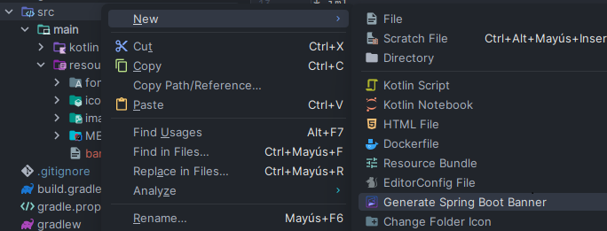

# 🌟 Spring Boot Banner Generator

A simple yet powerful IntelliJ IDEA plugin to generate ASCII art banners for your Spring Boot applications using FIGlet fonts.

## 📌 Plugin ID

`org.maravill.SpringBootBannerGenerator`

## ✨ Features

- 🖋️ Convert custom text into stylish ASCII art banners.
- 🔎 Filter and choose from a wide variety of fonts.
- 🎨 Real-time preview panel.
- 💾 Automatically creates a `banner.txt` file inside `src/main/resources`.
- 🧠 Remembers your selected font.
- 🖼️ Custom icon integration.

## 📦 How to Use

1. **Right-click** on the `src` folder of your project or module.
2. Choose: `New → Generate Spring Boot Banner`.
3. Enter your banner text and choose a FIGlet font.
4. Click `OK` – a `banner.txt` file will be generated with your selected style.
   

## 🧪 Screenshot


## 🔧 Requirements

- IntelliJ IDEA **2025.1+**
- JDK 17
- Gradle (Kotlin DSL)

## 📦 Manual Installation

1. Clone the repository:
   ```bash
   git clone https://github.com/EduardoMaravilla/SpringBootBannerPlugin.git
   ```
2. Open the project in IntelliJ IDEA
3. Build the plugin using the Gradle task `buildPlugin`:
   ```bash
   ./gradlew buildPlugin
   ```
4. Install theplugin:
   - Go to `File → Settings → Plugins → Install Plugin from Disk...`
   - Select the generated `.zip` file from the `build/distributions` directory.
## 🛠️ Built With

- <a href="https://plugins.jetbrains.com/docs/intellij/welcome.html" target="_blank">IntelliJ Platform Plugin SDK</a>
- <a href="https://github.com/lalyos/jfiglet" target="_blank">jfiglet</a> for ASCII art generation
- Kotlin & Java
- IntelliJ Plugin Gradle Plugin

## 🎨 Icon Credits

Icon from <a href="https://icons8.com/icon/UCgJoZGoeBg1/sublime-text-new-logo" target="_blank">Icons8 - Sublime Text New Logo</a>

## 📄 License

This project is licensed under the MIT License - see the <a href="LICENSE" target="_blank">LICENSE</a> file for details.

---

Made with ❤️ by <a href="https://eduardo-maravilla.netlify.app/" target="_blank">Eduardo Maravilla</a>

   